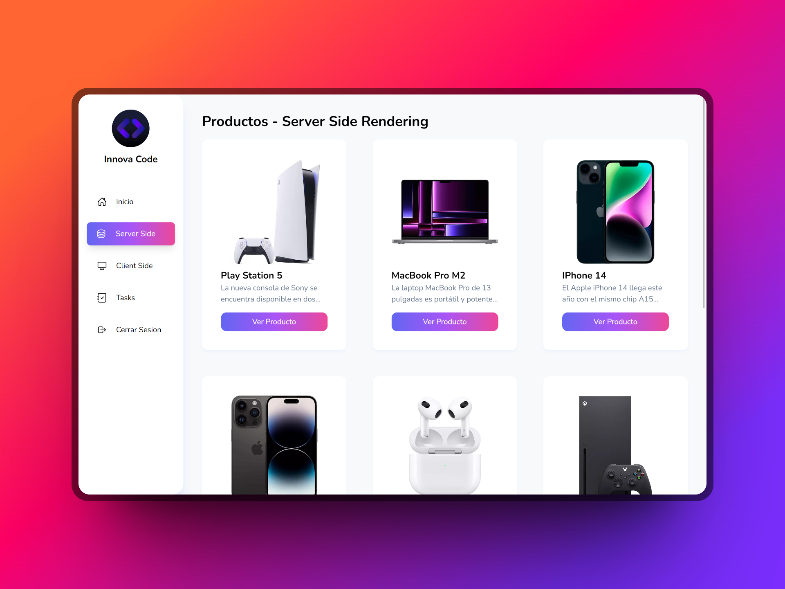

# Next Dashboard
This project is created with Next JS in its version 13, using the latest tools that it provides such as the new app router, the new way of doing data fetching, server actions (alpha) and the creation of a REST API.
For this project to work correctly you must create a Docker container with a PostgreSQL image where the data will be stored since it uses Auth.JS for authentication and data and user registration.

Preview: 


## Install project
```bash
npm install
```

## Run Database
```bash
docker compose up -d

npx prisma db pull

npx prisma generate 
```

Open [http://localhost:3000](http://localhost:3000) with your browser to see the result.
